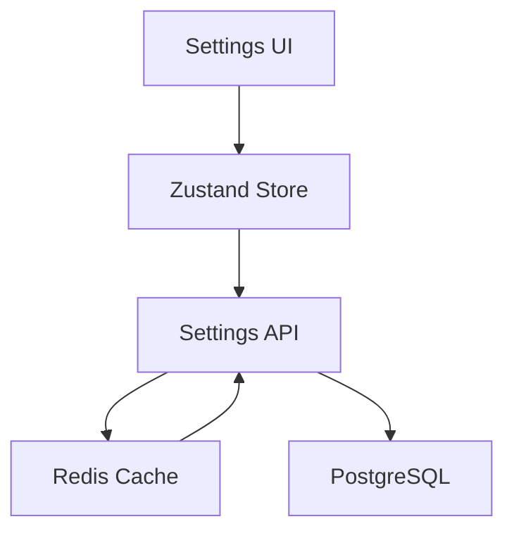

# R3 System Architecture

## System Overview
R3 (Root Request Router) is designed as a modular, scalable middleware system that serves as an integration layer between Root Network nodes, Reality2 systems, and enterprise user management.

## Core Components

### 1. User Interface Layer
- Built with React and Tailwind CSS
- Modular component architecture
- Responsive design for all device sizes
- Real-time updates using WebSocket connections

### 2. Security Layer


#### Key Security Features
- Role-Based Access Control (RBAC)
- Permission templating
- Multi-factor authentication
- Session management
- Comprehensive audit logging

### 3. Container Management


#### Container Features
- Automated container lifecycle management
- Health monitoring
- Resource usage tracking
- Log aggregation

### 4. Integration Layer
- Root Network integration
- Reality2 system integration
- External API management
- Event synchronization

## Data Flow


## Security Architecture

### Authentication Flow
1. Initial user authentication
2. MFA verification (if enabled)
3. Session token generation
4. Continuous session validation

### Permission Management
- Hierarchical role structure
- Granular permission controls
- Permission inheritance
- Template-based assignment

## Scalability Considerations

### Horizontal Scaling
- Stateless API design
- Container orchestration
- Load balancing
- Cache management

### Vertical Scaling
- Resource optimization
- Performance monitoring
- Database optimization

## Development Architecture

### Development Environment


### CI/CD Pipeline
1. Automated testing
2. Code quality checks
3. Security scanning
4. Containerization
5. Deployment

## Monitoring and Logging

### System Monitoring
- Container health
- Resource usage
- Performance metrics
- Error tracking

### Audit Logging
- User actions
- System events
- Security incidents
- Performance data

## Future Considerations

### Planned Enhancements
- Advanced analytics
- Machine learning integration
- Expanded automation
- Enhanced security features

### Scalability Roadmap
- Microservices architecture
- Kubernetes integration
- Global distribution
- Enhanced caching

## Technical Specifications

### Technology Stack
- Frontend: React, Tailwind CSS
- Backend: Node.js
- Database: PostgreSQL
- Container: Docker
- Cache: Redis
- Message Queue: RabbitMQ

### Performance Requirements
- Response Time: <100ms
- Availability: 99.9%
- Concurrent Users: 10,000+
- Data Retention: 90 days


# Architecture Update - Settings Management

## Settings Management System

### Data Flow


### Components
1. **Data Layer**
   - PostgreSQL for persistence
   - Redis for caching
   - Prisma for database access

2. **API Layer**
   - Validated endpoints
   - Cache management
   - Error handling

3. **Application Layer**
   - Zustand store for state management
   - Type-safe interfaces
   - Loading/error states

4. **Validation Layer**
   - Zod schemas
   - Runtime type checking
   - Error messaging

### Security Considerations
- Validated input/output
- Type safety throughout
- Cache invalidation strategies
- Error handling and logging

### Performance Optimizations
- Redis caching
- Optimistic updates
- Proper loading states
```

Would you like me to:
1. Update any other documentation files?
2. Add more specific technical details to the architecture document?
3. Create new documentation specifically for the settings system?